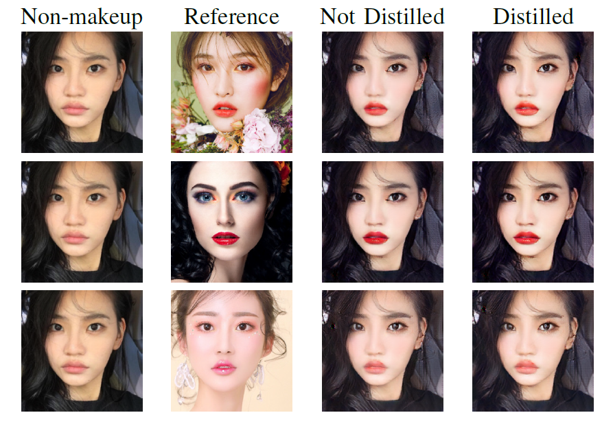

# Introduction
Official implementation of VCIP 2020 paper: "[Compressing Facial Makeup Transfer Networks by Collaborative Distillation and Kernel Decomposition](https://arxiv.org/abs/2009.07604)". In this project, we compressed facial makeup transfer networks (BeautyGAN) with collaborative distillation and kernel decomposition.

See our framework below.
<center></center>
If there are bugs, pls open an issue.

# Dependencies
* Python3 libs in requirements.txt, we recommend you to create and activate a virtual environment using Anaconda before install the packages. According to our experience, the versions are not strictly constrained. If you have any questions about the versions of the libs, pls open an issue.
* The code is tested on Ubuntu16.04

# Training
* Download shape_predictor_68_face_landmarks.dat from:
http://dlib.net/files/shape_predictor_68_face_landmarks.dat.bz2 , 
and uncompress it.

* Download pretrained vgg16 model from https://download.pytorch.org/models/vgg16-397923af.pth.

* We recommend you to create and activate a virtual environment using Anaconda

    * for python 3.*
    ```bash
    conda create -n py3 python==3.*
    source activate py3
    ```

* Install python dependencies using command:
    ```bash
    pip install -r requirements.txt
    ```
    
* Download the MT dataset and divide the training and testing image. Thanks to the authors of the BeautyGAN, you can reference the data preparing process from https://github.com/wtjiang98/BeautyGAN_pytorch . 
    
* We recommend you to organize your own directories for code, data , models and logs storage. So pls modify the code based on your directories and path.
    
* We only provide the single-GPU mode code for training. However, we recommend you to use multi-GPU mode to train the model with a higher speed. You can refer to  the official documents of Pytorch for further info.
    
* Run the beauty_res9.py to train an only decomposed model and run the beauty_gpu0.py based on the trained model of beauty_res9 (i.e., the teacher network) to train the student network.
    
    ```bash
    python MobileNet_BeautyGAN/beauty_res9.py
    python Distill_BeautyGAN/beauty_gpu0.py
    ```

We would add more details about the training and testing process if needed...If you have any questions, pls open an issue.

# Results

<center></center>

<center>Voting Results</center>

<center></center>

<center>Decompose only vs Decompose+Distill</center>

# Acknowledgment

We refer to the following implementations: [Collaborative-Distillation](https://github.com/MingSun-Tse/Collaborative-Distillation), [BeautyGAN_pytorch](https://github.com/wtjiang98/BeautyGAN_pytorch).

# Reference

Please cite this in your publication if our work helps your research. 

```
@inproceedings{yang2020compressing,
  title={Compressing Facial Makeup Transfer Networks by Collaborative Distillation and Kernel Decomposition},
  author={Yang, Bianjiang and Hui, Zi and Hu, Haoji and Hu, Xinyi and Yu, Lu},
  booktitle={2020 IEEE Visual Communications and Image Processing (VCIP)},
  pages={1--4},
  year={2020},
  organization={IEEE}
}
```

If you have any advice, you may access my [homepage](https://jian-danai.github.io/) or directly contact me at yangbj@zju.edu.cn , thanks.
